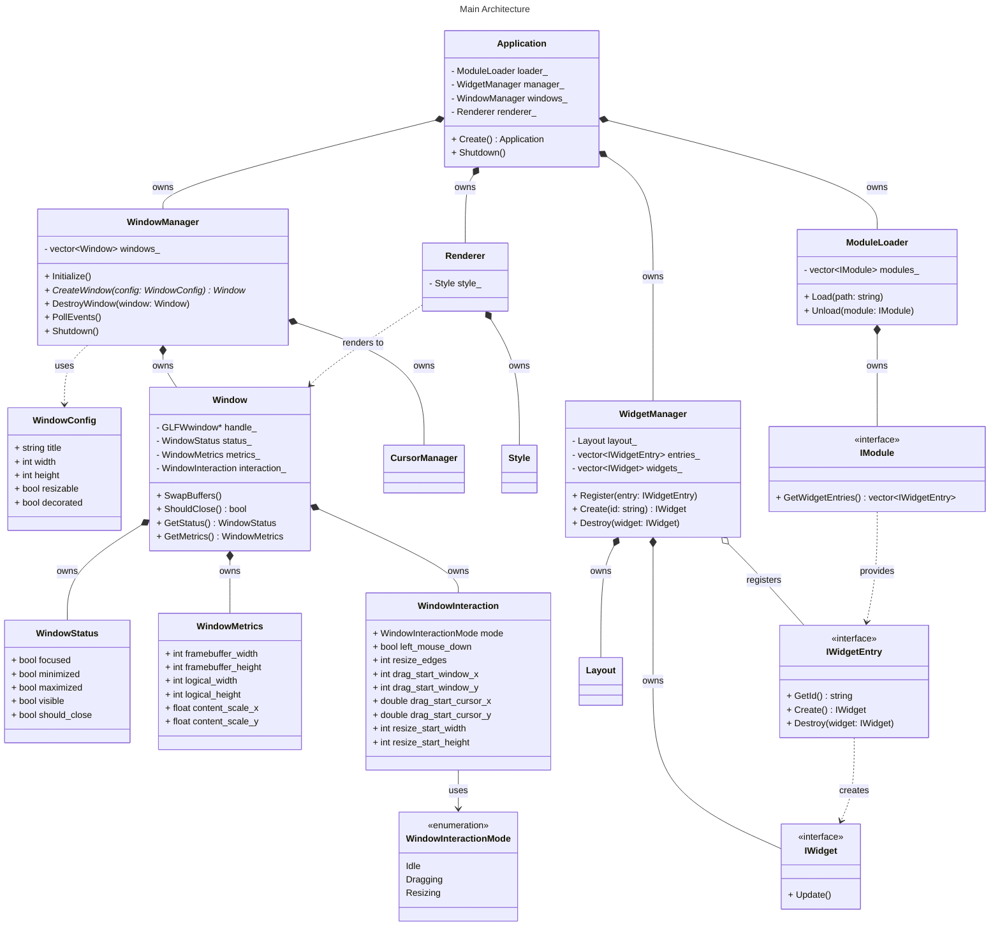

```mermaid
---
title: Main Architecture
---
classDiagram

class Application {
    - ModuleLoader loader_
    - WidgetManager manager_
    - WindowManager windows_
    - Renderer renderer_
    + Create() Application
    + Shutdown()
}

class Renderer {
    - Style style_
}

class WindowManager {
    - vector~Window~ windows_
    + Initialize()
    + CreateWindow(config: WindowConfig) Window*
    + DestroyWindow(window: Window)
    + PollEvents()
    + Shutdown()
}

class WindowConfig {
    + string title
    + int width
    + int height
    + bool resizable
    + bool decorated
}

class Window {
    - GLFWwindow* handle_
    - WindowStatus status_
    - WindowMetrics metrics_
    - WindowInteraction interaction_
    + SwapBuffers()
    + ShouldClose() bool
    + GetStatus() WindowStatus
    + GetMetrics() WindowMetrics
}

class WindowStatus {
    + bool focused
    + bool minimized
    + bool maximized
    + bool visible
    + bool should_close
}

class WindowMetrics {
    + int framebuffer_width
    + int framebuffer_height
    + int logical_width
    + int logical_height
    + float content_scale_x
    + float content_scale_y
}

class WindowInteraction {
    + WindowInteractionMode mode
    + bool left_mouse_down
    + int resize_edges
    + int drag_start_window_x
    + int drag_start_window_y
    + double drag_start_cursor_x
    + double drag_start_cursor_y
    + int resize_start_width
    + int resize_start_height
}

class WindowInteractionMode {
    <<enumeration>>
    Idle
    Dragging
    Resizing
}

class CursorManager

class Style

class ModuleLoader {
    - vector~IModule~ modules_
    + Load(path: string)
    + Unload(module: IModule)
}

class WidgetManager {
    - Layout layout_
    - vector~IWidgetEntry~ entries_
    - vector~IWidget~ widgets_
    + Register(entry: IWidgetEntry)
    + Create(id: string) IWidget
    + Destroy(widget: IWidget)
}

class Layout

class IModule {
    <<interface>>
    + GetWidgetEntries() vector~IWidgetEntry~
}

class IWidgetEntry {
    <<interface>>
    + GetId() string
    + Create() IWidget
    + Destroy(widget: IWidget)
}

class IWidget {
    <<interface>>
    + Update()
}

Application *-- ModuleLoader : owns
Application *-- WidgetManager : owns
Application *-- WindowManager : owns
Application *-- Renderer : owns

WindowManager *-- Window : owns
WindowManager ..> WindowConfig : uses
WindowManager *-- CursorManager : owns

Window *-- WindowStatus : owns
Window *-- WindowMetrics : owns
Window *-- WindowInteraction : owns

WindowInteraction --> WindowInteractionMode : uses

Renderer *-- Style : owns
Renderer ..> Window : renders to

WidgetManager *-- Layout : owns
WidgetManager o-- IWidgetEntry : registers
WidgetManager *-- IWidget : owns

ModuleLoader *-- IModule : owns
IModule ..> IWidgetEntry : provides
IWidgetEntry ..> IWidget : creates
```