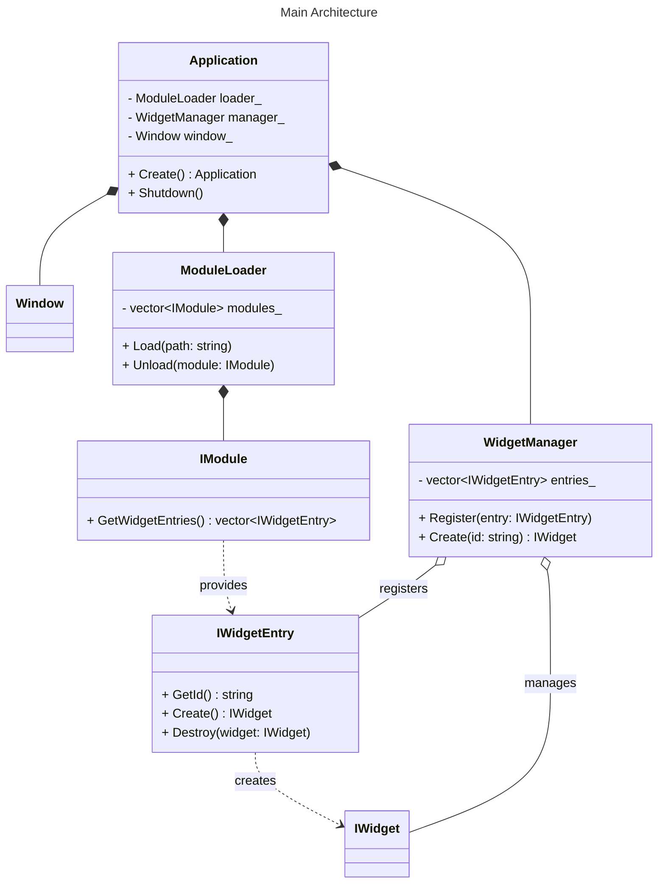

```mermaid
---
title: Main Architecture
---
classDiagram
    class Application {
        - ModuleLoader loader_
        - WidgetManager manager_
        - Window window_
        + Create() Application
        + Shutdown()
    }

    class Window

    class ModuleLoader {
        - vector~IModule~ modules_
        + Load(path: string)
        + Unload(module: IModule)
    }

    class WidgetManager {
        - vector~IWidgetEntry~ entries_
        + Register(entry: IWidgetEntry)
        + Create(id: string) IWidget
    }

    class IModule {
        + GetWidgetEntries() vector~IWidgetEntry~
    }

    class IWidgetEntry {
        + GetId() string
        + Create() IWidget
        + Destroy(widget: IWidget)
    }

    class IWidget

    Application *-- ModuleLoader
    Application *-- WidgetManager
    Application *-- Window

    ModuleLoader *-- IModule
    IModule ..> IWidgetEntry : provides
    WidgetManager o-- IWidgetEntry : registers
    IWidgetEntry ..> IWidget : creates
    WidgetManager o-- IWidget : manages
```