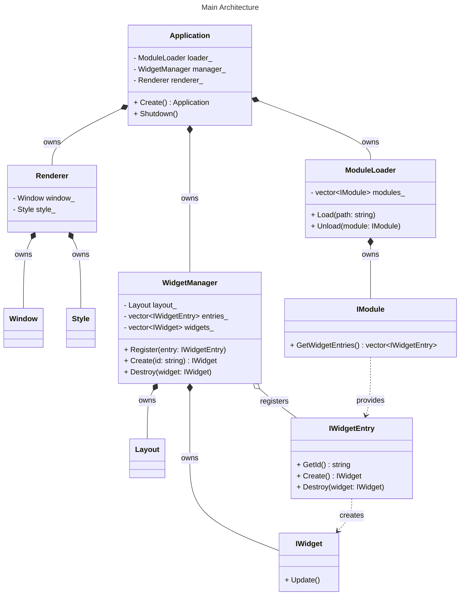

```mermaid
---
title: Main Architecture
---
classDiagram
class Application {
    - ModuleLoader loader_
    - WidgetManager manager_
    - Renderer renderer_
    + Create() Application
    + Shutdown()
}

class Renderer {
    - Window window_
    - Style style_
}

class Window
class Style

class ModuleLoader {
    - vector~IModule~ modules_
    + Load(path: string)
    + Unload(module: IModule)
}

class WidgetManager {
    - Layout layout_
    - vector~IWidgetEntry~ entries_
    - vector~IWidget~ widgets_
    + Register(entry: IWidgetEntry)
    + Create(id: string) IWidget
    + Destroy(widget: IWidget)
}

class Layout

class IModule {
    + GetWidgetEntries() vector~IWidgetEntry~
}

class IWidgetEntry {
    + GetId() string
    + Create() IWidget
    + Destroy(widget: IWidget)
}

class IWidget {
    + Update()
}

Application *-- ModuleLoader : owns
Application *-- WidgetManager : owns
Application *-- Renderer : owns

Renderer *-- Window : owns
Renderer *-- Style : owns

WidgetManager *-- Layout : owns
WidgetManager o-- IWidgetEntry : registers
WidgetManager *-- IWidget : owns

ModuleLoader *-- IModule : owns
IModule ..> IWidgetEntry : provides

IWidgetEntry ..> IWidget : creates
```