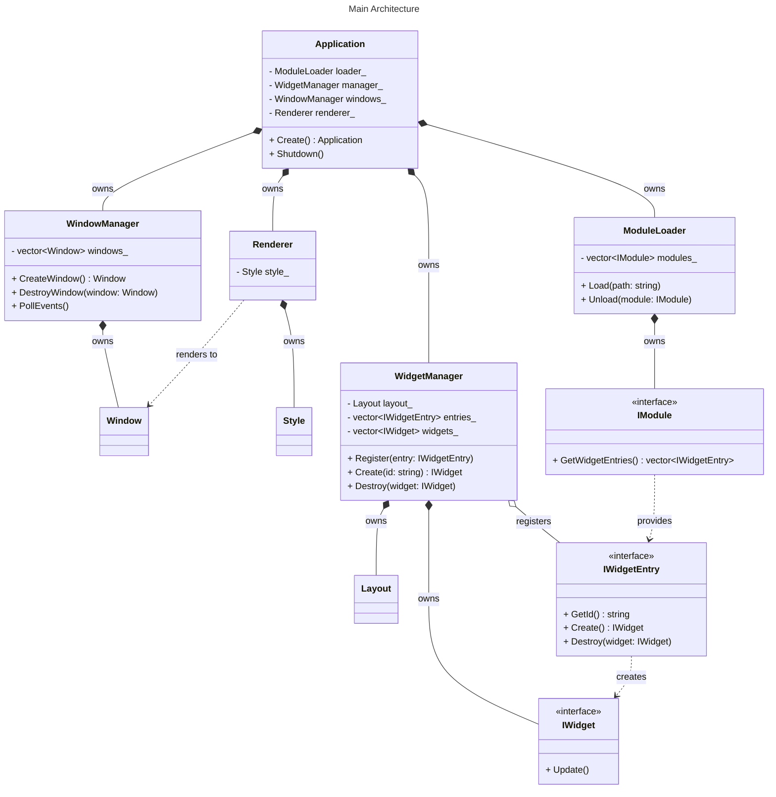

```mermaid
---
title: Main Architecture
---
classDiagram

class Application {
- ModuleLoader loader_
- WidgetManager manager_
- WindowManager windows_
- Renderer renderer_
+ Create() Application
+ Shutdown()
}

class Renderer {
- Style style_
}

class WindowManager {
- vector~Window~ windows_
+ CreateWindow() Window
+ DestroyWindow(window: Window)
+ PollEvents()
}

class Window

class Style

class ModuleLoader {
- vector~IModule~ modules_
+ Load(path: string)
+ Unload(module: IModule)
}

class WidgetManager {
- Layout layout_
- vector~IWidgetEntry~ entries_
- vector~IWidget~ widgets_
+ Register(entry: IWidgetEntry)
+ Create(id: string) IWidget
+ Destroy(widget: IWidget)
}

class Layout

class IModule {
<<interface>>
+ GetWidgetEntries() vector~IWidgetEntry~
}

class IWidgetEntry {
<<interface>>
+ GetId() string
+ Create() IWidget
+ Destroy(widget: IWidget)
}

class IWidget {
<<interface>>
+ Update()
}

Application *-- ModuleLoader : owns
Application *-- WidgetManager : owns
Application *-- WindowManager : owns
Application *-- Renderer : owns

WindowManager *-- Window : owns

Renderer *-- Style : owns
Renderer ..> Window : renders to

WidgetManager *-- Layout : owns
WidgetManager o-- IWidgetEntry : registers
WidgetManager *-- IWidget : owns

ModuleLoader *-- IModule : owns
IModule ..> IWidgetEntry : provides

IWidgetEntry ..> IWidget : creates
```